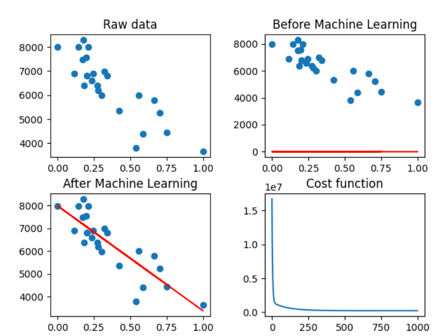

# ft_linear_regression
42 | Machine learning introduction

## Project
The goal of this algorithm is to model the relationship between two continuous variables for predict the value of an ouput variable based on the value of an input (predictor) variable.

    

## Explanations
